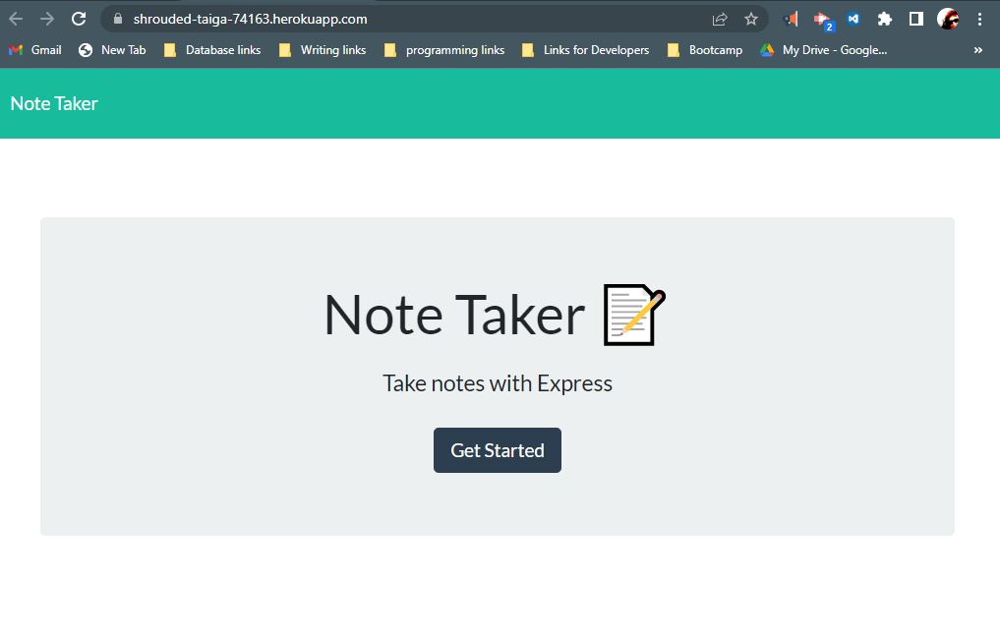
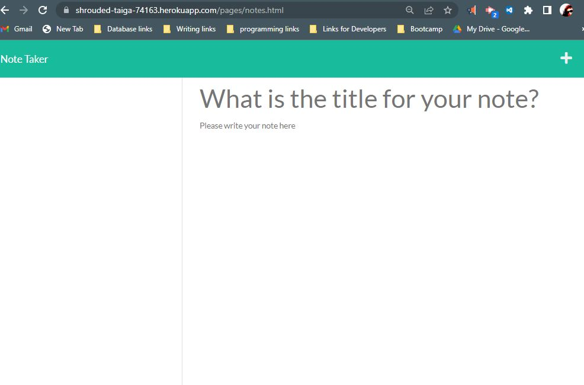
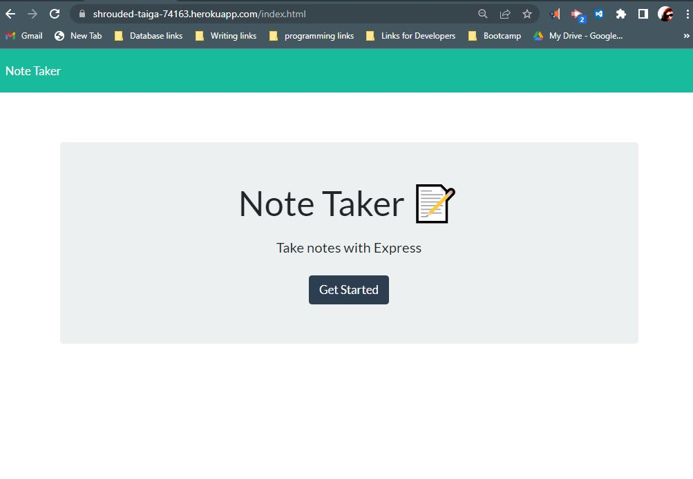
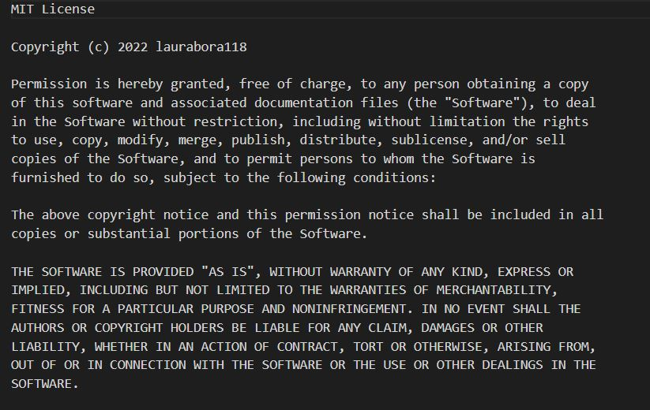

# uofa-module11-notetaker-lsandura
Express.js Challenge: Note Taker Bootcamp Module completed by Laura Sandura

Main Objective: 
AS A small business owner
I WANT to be able to write and save notes
SO THAT I can organize my thoughts and keep track of tasks I need to complete

Challenge: 
GIVEN a note-taking application
WHEN I open the Note Taker
THEN I am presented with a landing page with a link to a notes page
WHEN I click on the link to the notes page
THEN I am presented with a page with existing notes listed in the left-hand column, plus empty fields to enter a new note title and the note’s text in the right-hand column
WHEN I enter a new note title and the note’s text
THEN a Save icon appears in the navigation at the top of the page
WHEN I click on the Save icon
THEN the new note I have entered is saved and appears in the left-hand column with the other existing notes
WHEN I click on an existing note in the list in the left-hand column
THEN that note appears in the right-hand column
WHEN I click on the Write icon in the navigation at the top of the page
THEN I am presented with empty fields to enter a new note title and the note’s text in the right-hand column

Additional Expectations:
    using const PORT = process.env.PORT || 3001;
    *Bonus - adding a DELETE route to the application using the following guideline: DELETE /api/notes/:id should receive a query parameter containing the id of a note to delete. In order to delete a note, you'll need to read all notes from the db.json file, remove the note with the given id property, and then rewrite the notes to the db.json file.

Assignment Example 1 Picture:    
    
    
    
    
Git Repository link where finalzed project can be pulled:
    [Git Repo link](https://github.com/laurabora118/uofa-module11-notetaker-lsandura)  

Git page (*not required but link is for static read me only due to use of heroku server for this project):
    [github page read me](https://github.com/laurabora118/uofa-module11-notetaker-lsandura)

Heroku App id:
    shrouded-taiga-74163

Heroku deployed page (deployed to heroku using git push heroku main):
    [heroku deployed page](https://shrouded-taiga-74163.herokuapp.com/)
    
    heroku deployed routes
    notes route  https://shrouded-taiga-74163.herokuapp.com/pages/notes.html
    index route  https://shrouded-taiga-74163.herokuapp.com/index.html
    the * route  https://shrouded-taiga-74163.herokuapp.com/
    
How to use, run or deploy a clone:
    npm i to install
    node server.js to open local host
    /notes route to see notes page

Routes
    local server routes
    notes route http://localhost:3001/pages/notes.html 
    index route http://localhost:3001/index.html 
    the * route http://localhost:3001/ or https://shrouded-taiga-74163.herokuapp.com/

Video link of working app deployed: (if applicable)
    [not required]

References:
    1 - Assignment criteria received in UofA assignments, starter code provided

    2 - stackoverflow how to call middleware and add root directory to prevent html error

MIT License: 
    
